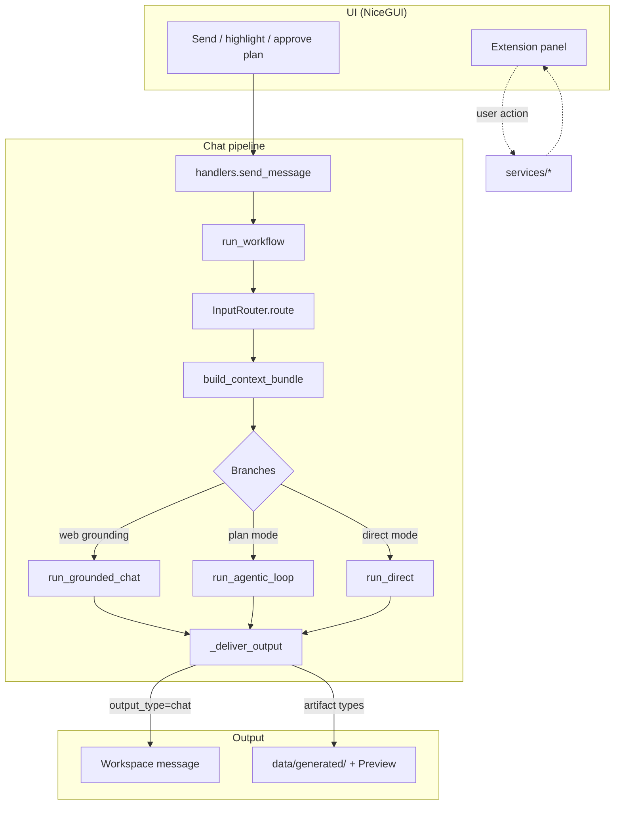

# LOMA workflow — input to output

Canonical reference for how a user request becomes a chat reply and/or a file in Preview.
Implementation lives in `pipeline/workflow.py`; extensions are a **parallel** path.

There is **no capability registry** and no “matched capability” step. Routing is **service-first**
(`InputRouter`) then **execution_mode** (`direct` | `plan`).

---

## At a glance

---

## Startup (`main.py`)

1. Load settings, session state, model roles (`config/`, `services/session/`).
2. `extension_registry.discover("extensions")` — mount tools from `extensions/*/extension.py`.
3. Service catalog loaded from `pipeline/registry/service_registry.py` (static list used by router and agents).
4. `build_ui()` — workspace, Input panel, Extension panel, Preview, Console.

Extensions appear in the dropdown per `config/extension_catalog.json` (`show_in_dropdown`, tier, etc.).

---

## Path A — Chat workflow (workspace)

### A.0 Triggers

| Trigger | Entry | Notes |
|---------|--------|--------|
| Workspace send | `services/session/handlers.py` → `send_message` | Preflight vision/media gaps; then background thread |
| Highlight / viewer query | `ui/components/viewer_query.py` | Wraps excerpt; same `start_loma_workflow` |
| Plan approval | `send_message` + `approve_plan_review` | Resumes plan mode after user approves plan |
| Plan revision | `revise_agentic_plan` | User edits plan text in chat |
| Delivery approval | `resume_agentic_after_delivery_approval` | Plan-mode delivery review gate |

All normal sends: `threading.Thread` → `pipeline/workflow.py` → `start_loma_workflow` → `run_workflow(user_input, NiceGUIStateSink)`.

### A.1 Progress stages (UI top bar)

`Intent` → `Planner` → `Execution` → `Synthesis`  
Updated via `pipeline/progress_stages.py` and `UISink`.

Cross-cutting on every run:

- **Cancellation** — `services/session/workflow_control.py` (`is_cancelled`, `begin_workflow` / `end_workflow`).
- **Stale output guard** — `_deliver_output` drops results if the user sent a newer message.
- **Session sync** — drafts, preview selection, mutation maps reset at workflow start.

---

### A.2 Stage 1 — Input capture

**From session state:**

- User text (plain, highlight-wrapped, or revision prompt).
- `active_context_files` — uploads (text, office, pdf, images, audio/video).
- `active_web_links` — URLs for optional scrape.
- Settings — `execution_mode`, output format dropdown, web grounding, profile id, user group (plan quota).
- Workspace — message history, preview draft, valid preview selection (forces mutation/generation mode).

**Code:** `build_input_metadata(state)` → `InputMetadata`  
(query, file/link counts, `has_docs`, `has_image`, `has_valid_preview_selection`, `needs_context_retrieval`, …).

---

### A.3 Stage 2 — Route and build context

| Step | Module | What happens |
|------|--------|----------------|
| 1. Route | `pipeline/input_router.py` | `InputRouter.route(meta)` → `RoutingDecision` |
| 2. Request | `pipeline/context_builder.py` | `build_request` — messages, files, links |
| 3. Profile | `extensions/profile_manager` | Resolve id, load YAML profile or defaults |
| 4. Web | `services/web_fetch.py` | If `web_fetch` ∈ `required_services`, scrape links (cache: `web_context_cache`) |
| 5. Bundle | `context_builder.build_context_bundle` | Parse via `file_io`, unify text/images/tables, retrieval for large sources |
| 6. Charts | `services/graph_generation.py` | Optional when `routing_helpers.should_enrich_with_graph_analysis` |
| 7. Image gap | `services/capability/gap_handler.py` | If `output_type=image` and packages missing → installer dialog, early exit |

**`RoutingDecision` fields** (no `capability_id`):

| Field | Meaning |
|-------|---------|
| `output_type` | `chat`, `document`, `presentation`, `spreadsheet`, `sound`, `image` |
| `required_services` | e.g. `llm_bridge`, `file_io`, `web_fetch`, `renderer`, `image_generation`, `media_transcription` |
| `mode` | `generation` or `mutation` (preview selection → generation) |
| `confidence`, `reason`, `llm_type` | Router metadata for logging / vision override |

Router logic: `resolve_deliverable_type`, `required_services_for_deliverable`, optional LLM service refine, special routes (transcription, image mutation, graph).

---

### A.4 Stage 3 — Execution branches

After context is ready, `execution_mode_from_settings` chooses the main path.

#### Branch 1 — Grounded chat (either mode)

When `should_use_grounded_chat(...)` (web search enabled, chat-shaped query, no blocking attachments):

- `pipeline/direct/grounded_runner.run_grounded_chat`
- Live web search + single-turn answer → `_deliver_output`
- **Bypasses** direct planner and plan orchestrator.

#### Branch 2 — Plan (`execution_mode = plan`)

`pipeline/agentic/runner.run_agentic_loop`:

1. **Plan** — `LomaOrchestrator.plan_agentic_mission` + `generate_subtask_instructions` → `AgenticPlan`.
2. **Plan review** — If `require_plan_confirmation`, pause with `plan_review`; user approves/revises in chat; resume via `approve_plan_review` / `revise_agentic_plan`.
3. **Execute** — `LomaFacilitator.delegate_and_validate` runs worker steps against plan.
4. **Compile gate** — `service_executor.run_compile_gate` for document/presentation/image deliverables.
5. **Delivery review** — Optional pause for user approval before final compile (`delivery_review`).
6. **Finish** — `_deliver_output` with chat summary or artifact path.

No usage quota or tier gating in the current version — every plan-mode run is available to every user.

Logs under `state.agentic_log_dir` per run.

#### Branch 3 — Direct (default)

`pipeline/direct/entry.run_direct`:

1. **Planner** — `plan_direct_query` (LLM) → `DirectPlan` (steps, `output_type`, `mode`, `express` flag).
2. **Express lane** — If `plan.express` and `can_use_express_lane`: `run_express_chat` (one LLM turn) or grounded variant.
3. **Step pipeline** — Else `step_executor.run_direct_pipeline`:
   - **Generation** — `role_pipeline` roles: extractor, summarizer, writer, slide_author, image roles, … via `llm_bridge`.
   - **Mutation** — Slice preview selection, per-unit edits, merge.
   - **Compile** — `save_preview_to_artifact` / `renderer` for non-chat types.

Internal helpers live in `pipeline/capability_runtime/` (role runners — **not** a user-facing capability registry).

---

### A.5 Stage 4 — Output delivery (`_deliver_output`)

| `output_type` | Behavior |
|---------------|----------|
| `chat` | Assistant bubble only; draft cleared; Preview status = chat |
| `document`, `presentation`, `spreadsheet`, `sound`, `image` | Draft → `save_preview_to_artifact` → `data/generated/`; Preview refresh; `artifact_ready`; assistant message gets summary/story text |

Presentation may use plan-compiled file if already on disk. Stale missions are discarded.

---

### A.6 Stage 5 — Result

- User sees chat text and/or Preview artifact (open, download, edit where supported).
- Progress indicators idle; `workflow_active` cleared.
- Plan-mode pauses leave plan/delivery cards in workspace until user acts.

---

## Path B — Extensions (parallel, user-selected)

Extensions **do not** go through `run_workflow` when the user only uses the extension UI.

| Extension | Typical flow |
|-----------|----------------|
| `document_intelligence` | Catalogue ingest → lexical/semantic index → Ask / Analyze |
| `formslator` | Format / translate DOCX, style mapping, glossary, translation vault |
| `history_events` | Scenario load → answer → grade |
| `profile_manager`, `chat_archive_manager` | Config and archives |

Pattern: `extension_registry` → `BaseExtension.mount()` → tabs → `services/*` on button click.  
Results stay in extension panels; may post side messages to workspace chat.

---

## Key modules (chat path)

| Concern | Path |
|---------|------|
| Main orchestration | `pipeline/workflow.py` |
| Service-first routing | `pipeline/input_router.py` |
| Context / retrieval | `pipeline/context_builder.py`, `pipeline/context_retrieval.py` |
| Direct execution | `pipeline/direct/entry.py`, `query_planner.py`, `step_executor.py` |
| Plan execution | `pipeline/agentic/runner.py`, `pipeline/orchestrator.py`, `pipeline/coordinator.py` |
| Role / chat runtime | `pipeline/capability_runtime/` |
| Deliverable specs | `pipeline/deliverables/` |
| UI entry | `services/session/handlers.py` |
| Atomic I/O | `services/file_io.py`, `services/web_fetch.py`, `services/llm_bridge.py`, `services/renderer.py` |

---

## Deliverable types (chat pipeline)

Handled by direct or plan code paths — not separate `capabilities/` folders:

- **chat** — default Q&A, summaries, analysis in workspace.
- **document / presentation / spreadsheet** — generation or mutation from preview selection.
- **sound** — TTS / audio artifact compile.
- **image** — `image_generation` service + optional gap installer.
- **media** — `media_transcription` for audio/video in context or export.

---

## Related docs

- [README.md](../README.md) — end-user quick start (download, run, first-run setup)
- [ARCHITECTURE.md](ARCHITECTURE.md) — registries, pipeline stages, architectural rules
- [dependency_map.md](dependency_map.md) — import map and smoke checklist
- [loma_workflow_flowchart.png](loma_workflow_flowchart.png) — visual diagram
